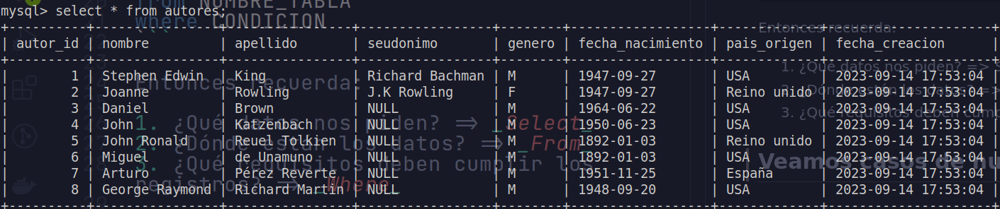
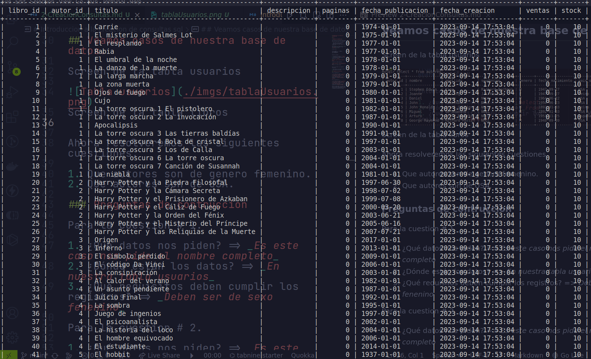

# Introduccion a la creacion de consultas sql

## Tip.

**PREGUNTAS DE CONSTRUCCIÓN**

Para construir una consulta SQL debemos hacernos como mínimo tres preguntas:

- ¿Qué datos nos están pidiendo?
- ¿Dónde están esos datos?
- ¿Qué requisitos deben cumplir los registros?

Seleccióname el atributo **X** y **Y**
del archivo **E** cuyo E.F sea **condicion** a esto

En Sql seria:

```
select CAMPO_1, ..., CAMPO_N
from NOMBRE_TABLA
where CONDICION
```

Entonces recuerda:

1. ¿Qué datos nos piden? => _Select_
2. ¿Dónde están los datos? => _From_
3. ¿Qué requisitos deben cumplir los registros? => _Where_

## Veamos casos de nuestra base de datos.

Screen de la tabla usuarios



Screen de la tabla libros


Ahora resolveremos las siguientes cuestiones.

1. Que autores son de genero femenino.
2. Que autores son de USA.

### Preguntas de contruccion

Para la cuestion # 1.

1. ¿Qué datos nos piden? => _Es este caso nos pide el nombre completo_
2. ¿Dónde están los datos? => _En nuestra tabla usuarios_
3. ¿Qué requisitos deben cumplir los registros? => _Deben ser de sexo fenenino_

Para la cuestion # 2.

1. ¿Qué datos nos piden? => _Es este caso nos pide el nombre completo_
2. ¿Dónde están los datos? => _En nuestra tabla usuarios_
3. ¿Qué requisitos deben cumplir los registros? => _Deben ser de USA_

Ahora tu puedes jugar con nuestra base de datos formulandote preguntas como las de arriba y repondiendolas con las 3 preguntas 3(de guia) de arriba.

## Operador BETWEEN

Se utiliza en SQL para seleccionar registros de una tabla que se encuentren dentro de un rango específico de valores. Este operador se usa comúnmente con columnas que almacenan datos numéricos, fechas o cadenas de texto.

La sintaxis general del operador `BETWEEN` es la siguiente:

`SELECT columnas
FROM tabla
WHERE columna BETWEEN valor_mínimo AND valor_máximo;
`

Sigamos a [Funciones de agregado](./3-FuncionesAgregado.md)
